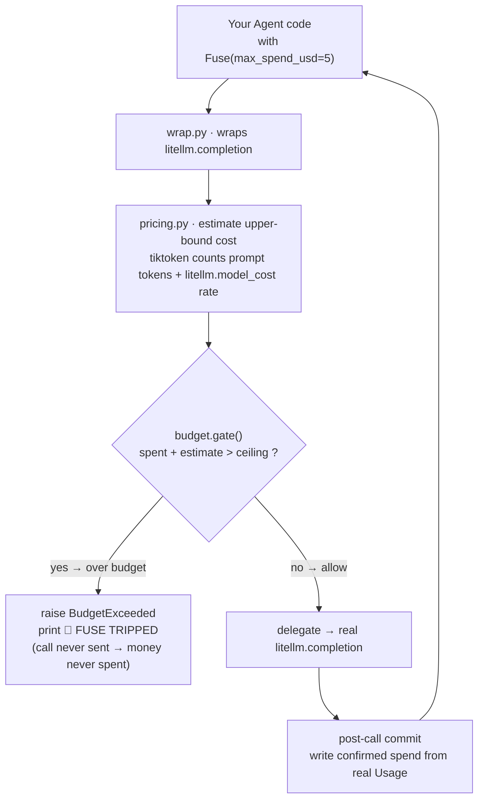

**English** | [简体中文](./README.md)

<p align="center">
  
</p>

<p align="center">
  <a href="./LICENSE"></a>
  
  <a href="https://github.com/supermario_leo/agentfuse/actions/workflows/ci.yml"></a>
  
  
</p>

<p align="center">
  <b>AgentFuse is the per-task spend circuit-breaker that halts an Agent before it burns your budget.</b>
</p>

---

> **In one line:** your Agent is running unattended — who's the fuse?
> AgentFuse puts a **hard ceiling** on a single task. When the *next* LLM call
> would push cumulative spend past that ceiling, AgentFuse cuts the agent loop
> **before the call is sent** and raises `BudgetExceeded` — the money is never
> spent. This is an *enforcing* circuit-breaker, not an after-the-fact cost chart.

## Table of contents

- [Why this exists](#why-this-exists)
- [Install](#install)
- [Quickstart (two lines)](#quickstart-two-lines)
- [Demo](#demo)
- [How it works](#how-it-works)
- [Enforcing fuse vs. passive dashboards](#enforcing-fuse-vs-passive-dashboards)
- [Configuration](#configuration)
- [Pricing · AgentFuse Cloud](#pricing--agentfuse-cloud)
- [Roadmap](#roadmap)
- [License & contributing](#license--contributing)
- [Share this](#share-this)

## Why this exists

In early 2026 a viral HN thread — [“AI agent bankrupted their operator while
trying to scan DN42”](https://news.ycombinator.com/) (**1284 points / 466
comments**) — described something that made a lot of operators wince: an
autonomous Agent stuck in a loop, firing paid call after paid call while scanning
the DN42 network, and **it bankrupted its operator**.

The core pain: after you hand an Agent a task, there is **nowhere** to set a hard
limit of *“this task spends at most \$X, then stop immediately”* before it
finishes. Provider consoles and cost dashboards only report spend **after the
money is already gone**. What's missing isn't another chart — it's a guardrail
that **acts**: one that cuts the self-perpetuating loop *before* the ceiling is
crossed.

AgentFuse is that fuse. Wrap any Agent in an executable budget guardrail before
you deploy it, and the tail risk of *“one task bankrupts one person”* drops from
a disaster to a single intercepted log line.

##  Architecture

<p align="center">
  <picture>
    <source media="(prefers-color-scheme: dark)" srcset="./assets/atlas-dark.svg">
    <source media="(prefers-color-scheme: light)" srcset="./assets/atlas-light.svg">
    
  </picture>
</p>

An agent call first enters **AgentFuse's own wrapper** (`wrap.py`, running *before* litellm). `pricing.py` counts prompt tokens with tiktoken and prices them via `litellm.model_cost` to compute an upper-bound estimate, then `budget.gate()` compares *spent + estimate* against this task's USD ceiling. **If it would cross the ceiling, `BudgetExceeded` is raised before the call goes out — 🔌 the fuse trips and the money is never spent**; only within budget does it delegate to the real `litellm.completion`, then commit the confirmed spend from the response's real `Usage` back to the per-task ledger. The whole decision lives inside the `with Fuse(max_spend_usd=…)` budget window.

## Install

```bash
pip install agentfuse
```

One command — no service, no daemon, no database.

## Quickstart (two lines)

Wrap your Agent's main call in `Fuse` and give the task a hard ceiling:

```python
import agentfuse

agentfuse.install()                       # one-time: take over litellm.completion / acompletion

with agentfuse.Fuse(max_spend_usd=5.00):  # this task spends at most $5
    run_my_agent()                        # every LLM call inside is gated + metered
```

When the next call *would* push cumulative spend past \$5, AgentFuse raises
`BudgetExceeded` **before the call is sent**, and prints:

```
🔌 FUSE TRIPPED — task halted at $4.98 / $5.00 ceiling (next call est. +$0.04 would cross it; call not sent)
```

> Prefer a decorator? `@agentfuse.fuse(max_spend_usd=5.0)`. Don't want a
> monkeypatch? Call the guarded `agentfuse.completion(...)` directly.

##  Demo

`agentfuse demo` reproduces the runaway loop from that HN thread and cuts it
off live — **fully offline** (litellm `mock_response`, no API key needed):

```bash
agentfuse demo --ceiling 0.50
```

<!-- demo.gif is generated from docs/demo.tape via `vhs docs/demo.tape` (see assets/README.md) -->
<p align="center">
  
</p>

> 📼 The GIF isn't committed — run `vhs docs/demo.tape` to generate it (see
> [assets/README.md](./assets/README.md)). Here is the real output of that command:

<details>
<summary>real run output</summary>

```text
Runaway-agent demo — per-task ceiling $0.50
Running offline (litellm mock_response — no API key needed).

  call # 1 ok  | spent $0.0230 / $0.50  | remaining $0.4770
  call # 2 ok  | spent $0.0460 / $0.50  | remaining $0.4540
  ...
  call #19 ok  | spent $0.4370 / $0.50  | remaining $0.0630
  call #20 ok  | spent $0.4600 / $0.50  | remaining $0.0400

🔌 FUSE TRIPPED — task halted at $0.46 / $0.50 ceiling (next call est. +$0.04 would cross it; call not sent)

The fuse halted the run at $0.4600 of the $0.50 ceiling.
The next call (est. +$0.0401) was BLOCKED before it was ever sent — that spend was never incurred.

Without AgentFuse, this loop would have kept burning money.
```

</details>

## How it works

The whole thing hinges on putting the interception point in the right place. The
budget gate must run in **AgentFuse's own wrapper code**, *before* the request is
handed to LiteLLM — **not** in a LiteLLM in-process pre-call callback (that
callback is wrapped in a `[Non-Blocking]` try/except that *swallows* the
exception, so the HTTP request goes out anyway — it **can't** abort the call).
Raising inside our own wrapper is ordinary Python control flow: the over-budget
call is never reached, so **the money is never spent**.



The four-step loop (per call):

1. **Estimate** an upper bound on the call's cost from `max_tokens` + input tokens
   (conservative — better to trip a little early than overshoot).
2. **Gate** the estimate against the task's remaining budget — `raise` *before*
   delegating to litellm if it would cross the ceiling.
3. **Send**: delegate to the real `litellm.completion` only when within budget.
4. **Commit**: after the call returns, write confirmed spend back from the
   response's **real** `Usage`.

LiteLLM still normalizes the actual call, the price table, and the usage fields
across providers — so it's **zero-touch**; the fuse logic lives in your process,
before the call goes out — so it actually **stops** the spend.

## Enforcing fuse vs. passive dashboards

| Capability | AgentFuse | Provider console | Cost dashboards (Helicone / Langfuse-style) |
| --- | :---: | :---: | :---: |
| Per-task hard ceiling | ✓ | — | — |
| Acts **before** the spend happens | ✓ | — | — |
| Cuts the Agent loop mid-run | ✓ | — | — |
| Cross-provider spend visualization | partial | ✓ | ✓ |
| Historical reports / multi-axis breakdown | — | ✓ | ✓ |

Honestly: cost dashboards are far better at **aggregating, visualizing, and
slicing** spend — but their contract is *“read-only, never touch the runtime.”*
AgentFuse's verb is different: **it acts**, cutting the loop before the money is
gone.

## Configuration

| Option | Type | Default | Meaning |
| --- | --- | --- | --- |
| `max_spend_usd` | `float` | required | Hard USD ceiling for this task (arg to `Fuse` / `@fuse`). |
| `name` | `str` | `"task"` | Task label shown in the ledger and the trip banner. |
| `--ceiling` (CLI demo) | `float` | `0.50` | Per-task ceiling for `agentfuse demo`. |

> v0.1 keeps no persistent spend store (explicitly out of scope) — the ledger
> only exists inside one run's `with Fuse(...)` scope; it does not cross
> processes or runs. `agentfuse status` says so plainly.

## Pricing · AgentFuse Cloud

**The open-source SDK (this repo) is free forever** — a single-machine
circuit-breaker that builds install base and trust. Revenue comes from a hosted
control plane, **not** from locking the SDK.

Once several teammates each run Agents, the pain shifts from *“I'm afraid of
bankrupting myself”* to *“I can't govern the whole team's budget — I don't know
whose task is burning money.”* That's where the paid **AgentFuse Cloud** hosted
control plane comes in:

| Plan | Price | Includes |
| --- | --- | --- |
| **Team** | **\$29 / mo** | 3 seats; set/change per-project budget ceilings from the web (no code redeploy). |
| ＋ each extra seat | **+\$8 / mo** | Per-seat metering. |
| **Pro** | **\$99 / mo** | 10 seats ＋ cross-member/project quota alerts (Slack / Feishu webhook) ＋ 90-day audit retention and tripped-task replay. |

Minimum path-to-card: an SDK user adds one line `Fuse(..., report_to="cloud")` →
their task stream shows up on the web → when they want a single team-wide ceiling
they click Upgrade → three-step Stripe Checkout → the control plane is live.

> The v0.1 SDK ships only a `--report-endpoint` / `report_to=` upload-hook
> **stub**; the server-side control plane is out of scope for v0.1. The anchor is
> simple — one runaway loop can burn tens to hundreds of dollars, so the ROI of
> team-level control is self-evident.

## Roadmap

- [x] **m1 · Meter**: per-call token+USD estimator + a running per-task ledger.
- [x] **m2 · Fuse**: pre-call halt that raises `BudgetExceeded` *before* spend
      crosses the ceiling (USD / token dual ceilings, whichever trips first).
- [x] **m3 · Wrap + demo**: zero-touch `Fuse` / `@fuse` wrapping of litellm +
      the `agentfuse` CLI + a runaway-agent demo that trips the fuse.
- [ ] **AgentFuse Cloud**: team-level central budget policy, audit log, ceiling
      alerts (paid hosted control plane).
- [ ] Persistent spend store / cross-run budget rollover.
- [ ] Non-LLM cloud-resource (compute/storage/bandwidth) metering.
- [ ] First-class integration slots in the LiteLLM / hermes-agent / OpenViking
      ecosystems.

## License & contributing

[Apache-2.0](./LICENSE). Issues and PRs welcome — especially real *“my Agent
burned me too”* scenarios that help us tune the fuse.

After pushing to GitHub, set discovery topics on the repo:

```bash
gh repo edit --add-topic agent --add-topic llm --add-topic litellm --add-topic cost-control
```

## Share this

```text
Your AI Agent is running unattended — who's the fuse?
AgentFuse puts a hard per-task ceiling on it and 🔌 trips before the next LLM
call can bankrupt you — the money is never spent. Two lines, zero-touch on
LiteLLM. https://github.com/supermario_leo/agentfuse
```

---

<sub>Apache-2.0 © 2026 <a href="https://github.com/supermario_leo">supermario_leo</a></sub>
