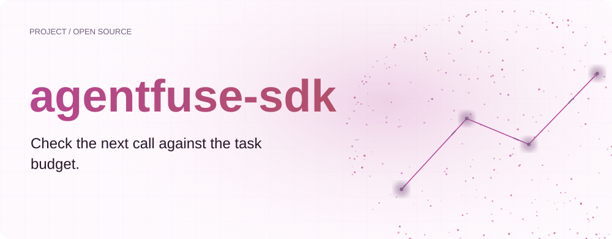
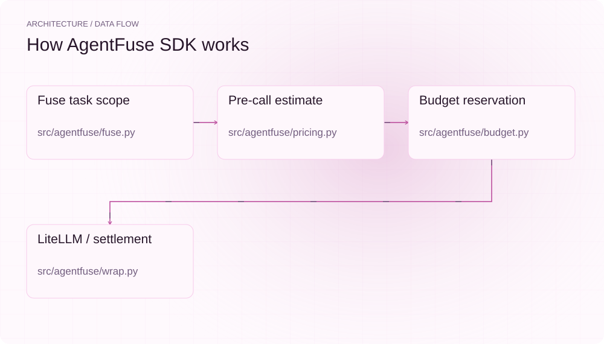
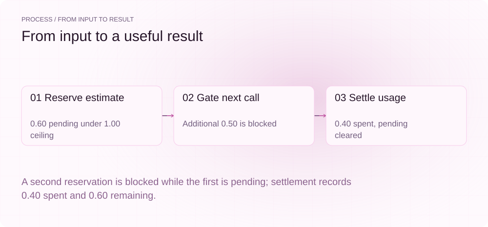
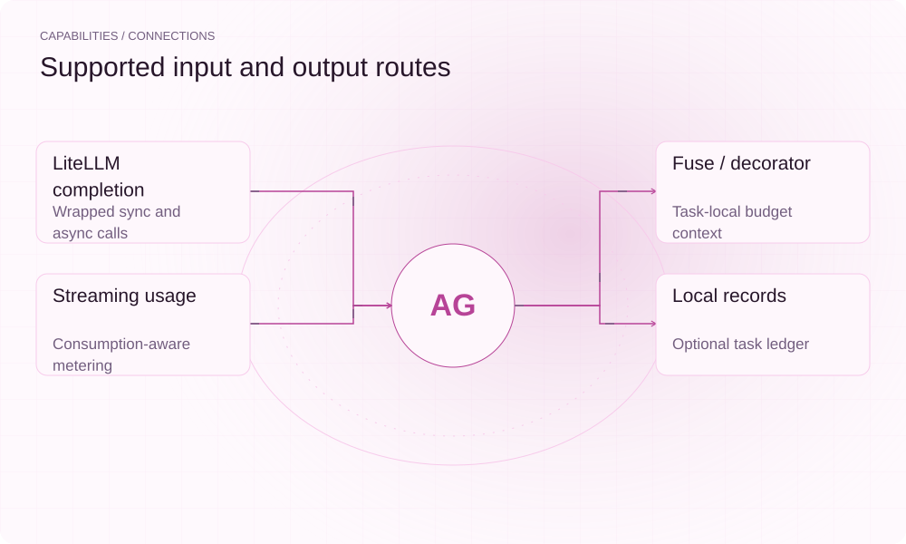

[简体中文](./README.md) · [Website](https://agentfuse-sdk.lei6393.com) · [GitHub](https://github.com/SuperMarioYL/agentfuse-sdk)

<picture>
  <source media="(max-width: 600px) and (prefers-color-scheme: dark)" srcset="./assets/presentation/hero-mobile-dark.svg">
  <source media="(max-width: 600px)" srcset="./assets/presentation/hero-mobile-light.svg">
  <source media="(prefers-color-scheme: dark)" srcset="./assets/presentation/hero-dark.svg">
  
</picture>

# agentfuse-sdk

**Check the next call against the task budget.**

AgentFuse SDK places a per-task budget around wrapped LiteLLM calls, reserving estimated cost before delegation and settling it after usage is reported.

v0.8.0 fixes USD settlement for unpriced models under fallback and ships the CLI demo inside the wheel. Fallback uses a conservative estimate; it does not replace the provider bill.

## Why use it

Concurrent calls can each appear affordable while together exceeding the remaining budget. Pending reservations make in-flight estimates visible to the next admission decision.

- **Pre-call admission** — An over-budget reservation fails before delegation.
- **Account for pending work** — Concurrent estimates share the pending balance.
- **Settle against usage** — Reservations are released or committed explicitly.

## Architecture

<picture>
  <source media="(max-width: 600px) and (prefers-color-scheme: dark)" srcset="./assets/presentation/architecture-mobile-dark.svg">
  <source media="(max-width: 600px)" srcset="./assets/presentation/architecture-mobile-light.svg">
  <source media="(prefers-color-scheme: dark)" srcset="./assets/presentation/architecture-dark.svg">
  
</picture>

Fuse scopes the active task budget. The wrapper estimates a call, reserves its cost, then invokes LiteLLM only if admitted. Success settles the reservation against reported usage; failures release it. The budget can constrain cumulative spend, token count and per-call cost.

| Component | Responsibility |
| --- | --- |
| `Fuse task scope` | src/agentfuse/fuse.py |
| `Pre-call estimate` | src/agentfuse/pricing.py |
| `Budget reservation` | src/agentfuse/budget.py |
| `LiteLLM / settlement` | src/agentfuse/wrap.py |

## Install and quickstart

Build with the version declared in the repository manifest. Run the example from the repository root.

```bash
git clone https://github.com/SuperMarioYL/agentfuse-sdk.git
cd agentfuse-sdk
```

The budget-only example runs from source with Python 3.11+ and explicit synthetic reservations; full LiteLLM adapter use requires the dependencies in pyproject.toml.

```bash
PYTHONPATH=src LITELLM_LOCAL_MODEL_COST_MAP=True python3 examples/presentation-demo.py
```

## Recorded demo

<picture>
  <source media="(max-width: 600px) and (prefers-color-scheme: dark)" srcset="./assets/presentation/process-mobile-dark.svg">
  <source media="(max-width: 600px)" srcset="./assets/presentation/process-mobile-light.svg">
  <source media="(prefers-color-scheme: dark)" srcset="./assets/presentation/process-dark.svg">
  
</picture>

A second reservation is blocked while the first is pending; settlement records 0.40 spent and 0.60 remaining.

```text
pending before completion: 0.60
second reservation: blocked before delegation
spent: 0.40; pending: 0.00; remaining: 0.60
```

The complete command and output are recorded in [docs/demo-results.json](./docs/demo-results.json). Inputs and reproduction code are included in the repository.


The existing recording is retained for context; the text example above documents the reproducible scenario.

## Usage

The CLI exposes the following operations. Commands after the example use your own paths or identifiers.

```bash
# Full adapter installation:
python -m pip install -e .
# Offline core example:
PYTHONPATH=src python3 examples/presentation-demo.py
```

## Configuration

Use agentfuse.install() to wrap LiteLLM’s completion functions, then run calls inside Fuse(max_spend_usd=...). Direct agentfuse.completion is another entrypoint. Set completion limits and choose on_unpriced deliberately; block is the default, while warn-pass bypasses meaningful price enforcement for unknown models.

## Integrations and responsibilities

<picture>
  <source media="(max-width: 600px) and (prefers-color-scheme: dark)" srcset="./assets/presentation/integrations-mobile-dark.svg">
  <source media="(max-width: 600px)" srcset="./assets/presentation/integrations-mobile-light.svg">
  <source media="(prefers-color-scheme: dark)" srcset="./assets/presentation/integrations-dark.svg">
  
</picture>

The following routes are implemented in the source. Choose the input that matches your task and keep the resulting artifact with your project.

| Route | Implemented role |
| --- | --- |
| LiteLLM completion | Wrapped sync and async calls |
| Fuse / decorator | Task-local budget context |
| Streaming usage | Consumption-aware metering |
| Local records | Optional task ledger |

## Limits and next steps

- Only calls using the wrapper and active budget are governed. Direct SDK calls, external processes and unrelated services remain outside that budget.
- Admission depends on token and price estimates. Incorrect provider pricing or unexpectedly larger usage can make the final bill differ from the estimate.
- The demo exercises reservations with synthetic amounts. It does not call LiteLLM or measure real provider spend.

Provider-specific metering and workload estimates need ongoing validation. The pure Budget API is useful independently when a caller owns its cost calculation.

## License and contributions

See [LICENSE](./LICENSE). When reporting an issue, include a minimal input, the command, and the observed output.
