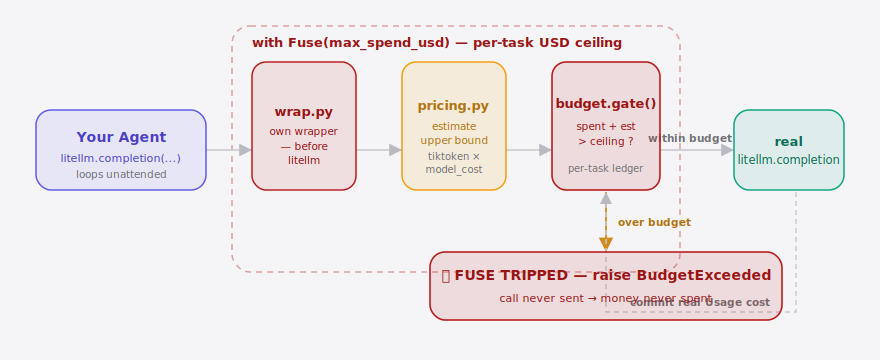
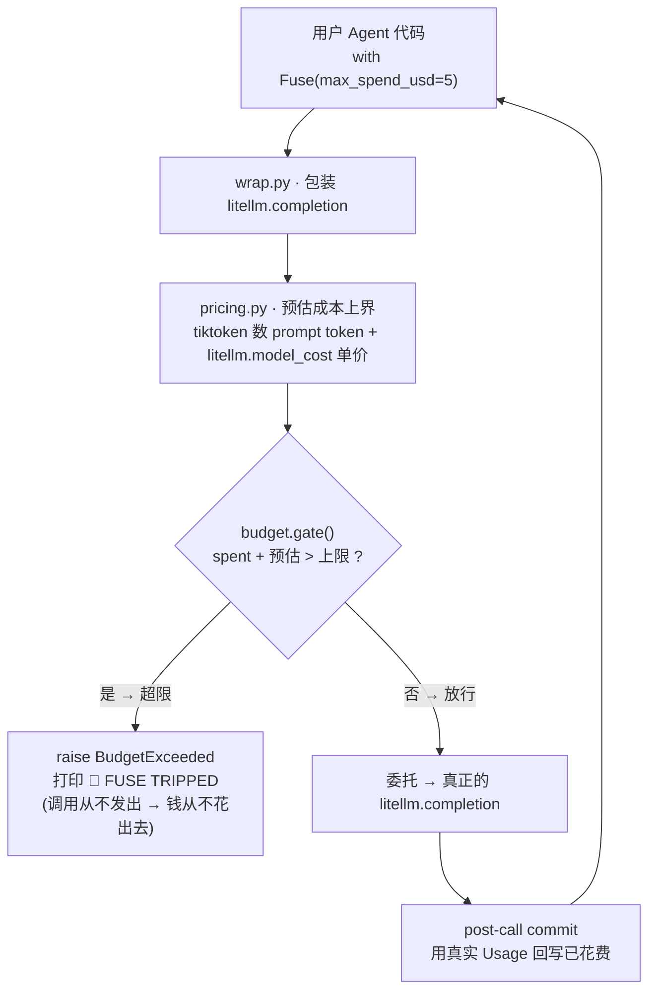

[English](./README.en.md) | **简体中文**

<p align="center">
  
</p>

<p align="center">
  <a href="./LICENSE"></a>
  
  <a href="https://github.com/supermario_leo/agentfuse/actions/workflows/ci.yml"></a>
  
  
</p>

<p align="center">
  <b>AgentFuse 是给自主 Agent 装的"花费保险丝"——在跑穷你之前先跳闸。</b>
</p>

---

> **一句话**：当你的 Agent 在无人值守地放手跑，谁来当那根保险丝?
> AgentFuse 给单次任务设一个**硬上限**，当下一次 LLM 调用**将要**把累计花费推过天花板时，它在调用**发出之前**就把 Agent loop 掐断、抛出 `BudgetExceeded`——钱根本没花出去。这是**执行式熔断**，不是事后画一张成本曲线图。

## 目录

- [为什么需要它](#为什么需要它)
- [安装](#安装)
- [快速上手](#快速上手两行)
- [演示](#演示)
- [工作原理](#工作原理)
- [对比：执行式熔断 vs 被动看板](#对比执行式熔断-vs-被动看板)
- [配置项](#配置项)
- [付费 · AgentFuse Cloud](#付费--agentfuse-cloud)
- [路线图](#路线图)
- [许可证与贡献](#许可证与贡献)
- [Share this](#share-this)

## 为什么需要它

2026 年初，一篇病毒级 HN 帖（[“AI agent bankrupted their operator while trying to scan DN42”](https://news.ycombinator.com/) · **1284 赞 / 466 评论**）讲了一件让无数运营者后背发凉的事：一个自主 Agent 在扫描 DN42 网络的循环里反复自主调用付费资源，**把操作者跑破产了**。

痛点的核心是：你给 Agent 派一个任务后，在它跑完之前，**没有任何一处**能设"本次任务最多花 \$X、到顶立刻停"的硬上限。Provider 控制台和成本看板都只能在钱**已经花掉之后**报账。真正缺的不是又一张图，而是一个**能动手**的护栏——在天花板被跨越之前，把那个会自我延续的循环掐断。

AgentFuse 就是那根保险丝：在部署任意 Agent 前给它套一个可执行的预算护栏，把"一个任务跑穷一个人"的尾部风险，从灾难降级为一条被拦截的日志。

##  架构

<p align="center">
  <picture>
    <source media="(prefers-color-scheme: dark)" srcset="./assets/atlas-dark.svg">
    <source media="(prefers-color-scheme: light)" srcset="./assets/atlas-light.svg">
    
  </picture>
</p>

一次 Agent 调用先进入 **AgentFuse 自己的包装层**（`wrap.py`，跑在 litellm **之前**），`pricing.py` 用 tiktoken 数 prompt token、按 `litellm.model_cost` 估出这次调用的成本**上界**，`budget.gate()` 再把"已花 + 估值"与本任务的 USD 天花板比对。**超限就在调用发出之前 `raise BudgetExceeded`——🔌 保险丝跳闸，钱根本没花出去**；未超限才委托给真正的 `litellm.completion`，返回后用响应里真实的 `Usage` 把已确认花费回写进 per-task 台账。整段判断都活在 `with Fuse(max_spend_usd=…)` 的预算窗口里。

## 安装

```bash
pip install agentfuse
```

只有一条命令——无服务、无 daemon、无数据库。

## 快速上手（两行）

把你的 Agent 主调用包进 `Fuse`，给这次任务设一个硬上限：

```python
import agentfuse

agentfuse.install()                       # 一次性接管 litellm.completion / acompletion

with agentfuse.Fuse(max_spend_usd=5.00):  # 本次任务最多花 $5
    run_my_agent()                        # 内部所有 LLM 调用被自动拦截计量
```

当下一次调用**将要**把累计花费推过 \$5 时，AgentFuse 在调用发出**之前**抛出 `BudgetExceeded`，并打印：

```
🔌 FUSE TRIPPED — task halted at $4.98 / $5.00 ceiling (next call est. +$0.04 would cross it; call not sent)
```

> 也可以用装饰器：`@agentfuse.fuse(max_spend_usd=5.0)`，或不 monkeypatch、直接调用受护栏的 `agentfuse.completion(...)`。

##  演示

`agentfuse demo` 一键复现那条帖子里的失控循环，并当场把它掐断——**完全离线**（litellm `mock_response`，无需 API key）：

```bash
agentfuse demo --ceiling 0.50
```

<!-- demo.gif 由 docs/demo.tape 通过 `vhs docs/demo.tape` 生成（见 assets/README.md） -->
<p align="center">
  
</p>

> 📼 GIF 暂未提交——运行 `vhs docs/demo.tape` 即可生成（见 [assets/README.md](./assets/README.md)）。下面是这条命令的真实输出：

<details>
<summary>真实运行输出</summary>

```text
Runaway-agent demo — per-task ceiling $0.50
Running offline (litellm mock_response — no API key needed).

  call # 1 ok  | spent $0.0230 / $0.50  | remaining $0.4770
  call # 2 ok  | spent $0.0460 / $0.50  | remaining $0.4540
  ...
  call #19 ok  | spent $0.4370 / $0.50  | remaining $0.0630
  call #20 ok  | spent $0.4600 / $0.50  | remaining $0.0400

🔌 FUSE TRIPPED — task halted at $0.46 / $0.50 ceiling (next call est. +$0.04 would cross it; call not sent)

The fuse halted the run at $0.4600 of the $0.50 ceiling.
The next call (est. +$0.0401) was BLOCKED before it was ever sent — that spend was never incurred.

Without AgentFuse, this loop would have kept burning money.
```

</details>

## 工作原理

关键在于**拦截点放对位置**。预算 gate 必须跑在 **AgentFuse 自己的包装代码**里、在把请求交给 LiteLLM **之前**——而**不是** LiteLLM 的进程内 pre-call 回调里（那个回调被包在 `[Non-Blocking]` 的 try/except 中，抛出的异常会被吞掉，HTTP 请求照常发出，**拦不住**调用）。在我们自己的包装函数里 `raise` 是普通的 Python 控制流：那次超预算的调用根本到不了，所以**钱从不花出去**。



四步循环（每次调用）：

1. **估**：用 `max_tokens` + 输入 token 估出这次调用的成本**上界**（保守，宁紧勿松）。
2. **判**（gate）：把估值与本任务剩余预算比对——超限就在委托给 litellm **之前** `raise`。
3. **发**：未超限才委托给真正的 `litellm.completion`。
4. **记**（commit）：调用返回后，用响应里**真实**的 `Usage` 回写已确认花费。

LiteLLM 仍负责统一各 provider 的实际调用、定价表与 usage 字段，所以**零侵入**成立；熔断逻辑住在你的进程里、住在调用发出之前，所以**拦得住**成立。

## 对比：执行式熔断 vs 被动看板

| 能力 | AgentFuse | Provider 控制台 | 成本看板（Helicone / Langfuse 类） |
| --- | :---: | :---: | :---: |
| 单任务（per-task）硬天花板 | ✓ | — | — |
| 在花费发生**之前**介入 | ✓ | — | — |
| 中途掐断 Agent loop | ✓ | — | — |
| 跨 provider 归一花费可视化 | 部分 | ✓ | ✓ |
| 历史报表 / 多维拆分 | — | ✓ | ✓ |

诚实地说：成本看板在**归集、可视化、按维度拆分**上比我们做得好得多——但它们的契约是"只读不写、不介入运行时"。AgentFuse 的动词不同：**它会动手**，在钱花出去之前把循环掐断。

## 配置项

| 配置 | 类型 | 默认值 | 含义 |
| --- | --- | --- | --- |
| `max_spend_usd` | `float` | 必填 | 本次任务的 USD 硬上限（`Fuse` / `@fuse` 的参数）。 |
| `max_total_tokens` | `int` | `None` | 可选的**整任务累计 token** 上限——与 USD 上限并行，先触顶者为准。注意它是「整任务」上限，不是单次调用的补全长度 `max_tokens`。（旧的 `Fuse(max_tokens=...)` 仍作为**已弃用别名**保留一个版本，会发 `DeprecationWarning`。`@fuse` / `task` 一直用更清晰的 `ceiling_tokens`。） |
| `single_call_ceiling` | `float` | `None` | 可选的**单次调用** USD 硬上限，避免一个超大 prompt 一发就把整笔预算打穿。 |
| `on_unpriced` | `str` | `"block"` | 模型不在 `litellm.model_cost` 时的策略：`"block"`（失败即熔断 → `UnpricedModelError`）、`"fallback"`（按保守单价估）、`"warn-pass"`（不拦放行）。 |
| `name` | `str` | `"task"` | 任务标签，显示在台账与跳闸横幅里。 |
| `--ceiling`（CLI demo） | `float` | `0.50` | `agentfuse demo` 用的每任务上限。 |

> **未定价模型默认失败即熔断（v0.2）**：价目表里查不到的模型无法估价，也就无法对它兜底——现在会抛 `UnpricedModelError`，而不是悄悄放行。需要时用 `on_unpriced="fallback"` 或 `"warn-pass"` 逐任务退回旧行为。

> **持久化花费存储 —— v0.2 提供一个可选的 append-only JSONL 花费记录（供 `agentfuse status` 跨进程读取上一次任务的真实花费）；跨 run 预算滚存仍延后。** 实时台账依旧只活在一次 `with Fuse(...)` 作用域里；想要跨进程历史，任务结束后调一次 `agentfuse.record_task(budget, tripped=..., log_path=...)`，再用 `agentfuse status --log <path>` 读回。这是执行邻接的记录，不是看板、不是监控服务。

## 付费 · AgentFuse Cloud

**开源 SDK（本仓库）永久免费**——单机熔断器，建立装机与信任。变现靠的是托管控制面，而**不是**给 SDK 加锁。

当团队里多个成员各自跑 Agent，痛点就从"我一个人怕跑穷"升级成"我管不住全队的预算、不知道谁的任务在烧钱"。这时上 **AgentFuse Cloud** 付费托管控制面：

| 套餐 | 价格 | 包含 |
| --- | --- | --- |
| **Team** | **\$29 / 月** | 3 席；网页集中设/改各项目预算上限（不用改代码重发）。 |
| ＋每增 1 席 | **+\$8 / 月** | 按席位计量。 |
| **Pro** | **\$99 / 月** | 10 席 ＋ 跨成员/项目配额告警（Slack / 飞书 webhook）＋ 90 天审计留存与触顶任务回放。 |

最小"刷卡"路径：SDK 用户加一行 `Fuse(..., report_to="cloud")` → 网页扫到自己的任务流入 → 想给全队设统一上限时点 Upgrade → Stripe Checkout 三步刷卡 → 控制面立即生效。

> v0.1 的 SDK 只留一个 `--report-endpoint` / `report_to=` 上报钩子的 **stub**；服务端控制面不在 v0.1 范围内。锚定逻辑很直白——一次失控循环就可能烧掉几十上百刀，团队级管控的 ROI 一目了然。

## 路线图

- [x] **m1 · 计量器**：per-call token+USD 估算 + 运行中的 per-task 台账。
- [x] **m2 · 熔断**：pre-call halt，在花费跨过天花板**前**抛 `BudgetExceeded`（USD / token 双上限，先触顶者为准）。
- [x] **m3 · 包装 + demo**：零侵入 `Fuse` / `@fuse` 包装 litellm + `agentfuse` CLI + 会被掐断的 runaway-agent demo。
- [x] **v0.2 · 加固**：未定价模型失败即熔断（`on_unpriced`）、token 上限（`max_total_tokens`）与单次调用硬上限（`single_call_ceiling`），外加一个可选的 JSONL 花费记录，喂给 `agentfuse status --log`。
- [x] **v0.3 · 流式计量 + 命名修正**：`stream=True` 的调用现在会在流耗尽时正确计量（有 usage 用真实花费，无 usage 用调用前估算上界），累计熔断不再对流式调用失效——这是 agent 最常用的调用模式。同时把 `Fuse` 的累计 token 上限关键字从易混淆的 `max_tokens` 改名为 `max_total_tokens`（旧名保留为弃用别名）。
- [ ] **AgentFuse Cloud**：团队级集中预算策略、审计日志、触顶告警（付费托管控制面）。
- [ ] 跨 run 预算滚存（v0.2 的记录是只读历史；滚存仍延后）。
- [ ] 非 LLM 云资源（算力/存储/带宽）计量。
- [ ] 直接进 LiteLLM / hermes-agent / OpenViking 生态的集成位。

## 许可证与贡献

[Apache-2.0](./LICENSE)。欢迎 issue 与 PR——尤其欢迎"我也被 Agent 烧过"的真实场景，帮我们把保险丝调得更准。

推送到 GitHub 后，建议给仓库打上 topic 方便被发现：

```bash
gh repo edit --add-topic agent --add-topic llm --add-topic litellm --add-topic cost-control
```

## Share this

```text
你的 AI Agent 正在无人值守地放手跑——谁来当那根保险丝?
AgentFuse 给单次任务设硬上限，在下一次 LLM 调用把你跑穷之前就 🔌 跳闸——
钱根本没花出去。两行接入，挂在 LiteLLM 上零侵入。 https://github.com/supermario_leo/agentfuse
```

---

<sub>Apache-2.0 © 2026 <a href="https://github.com/supermario_leo">supermario_leo</a></sub>
